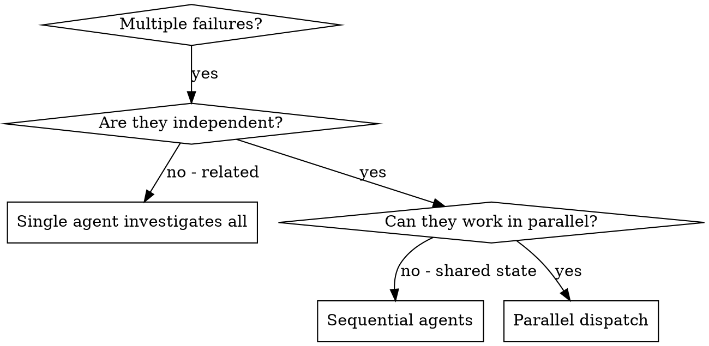

# Dispatching Parallel Agents：并行派发子代理

把任务委派给**上下文隔离**的专门代理：精确构造它所需的说明与上下文，它绝不应继承你的会话历史。这样既让它专注，也为你保留协调所需的上下文。

**核心原则：一个独立问题域派一个代理，让它们并发工作。**

## 何时用



**适用**：

- 3+ 测试文件以不同根因失败
- 多个子系统各自独立损坏
- 每个问题无需其他问题的上下文即可理解
- 各调查之间无共享状态

**不适用**：

- 失败彼此相关（修一个可能连修其他）→ 先一起调查
- 需要理解完整系统状态
- 代理会互相干扰（改同一文件、抢同一资源）
- 探索性调试（还不知道坏了什么）

## 模式

### 1. 识别独立问题域

按"坏了什么"分组：File A → tool approval flow；File B → batch completion；File C → abort。各域独立，修 A 不影响 C。

### 2. 构造聚焦的代理任务

每个代理拿到：

- **明确范围**：一个测试文件或子系统
- **清晰目标**：让这些测试通过
- **约束**：不要改其他代码
- **期望输出**：你发现了什么、修了什么

### 3. 并行派发

在**同一条回复**里发出全部派发调用，它们即并行执行；一条回复一个调用则是串行。

```text
Subagent: "Fix agent-tool-abort.test.ts failures"
Subagent: "Fix batch-completion-behavior.test.ts failures"
Subagent: "Fix tool-approval-race-conditions.test.ts failures"
# 三个并发运行
```

### 4. 汇总与整合

代理返回后：读每份总结 → 确认修改不冲突 → 跑全量测试 → 整合全部改动。

## 代理提示结构

好的提示：**聚焦**（一个清晰问题域）、**自包含**（理解问题所需全部上下文）、**对输出有要求**（要返回什么）。

```markdown
Fix the 3 failing tests in src/agents/agent-tool-abort.test.ts:

1. "should abort tool with partial output capture" - expects 'interrupted at' in message
2. "should handle mixed completed and aborted tools" - fast tool aborted instead of completed
3. "should properly track pendingToolCount" - expects 3 results but gets 0

These are timing/race condition issues. Your task:
1. Read the test file and understand what each test verifies
2. Identify root cause - timing issues or actual bugs?
3. Fix by replacing arbitrary timeouts with event-based waiting, fixing bugs in
   the abort implementation if found, or adjusting test expectations if behavior changed.

Do NOT just increase timeouts - find the real issue.

Return: Summary of what you found and what you fixed.
```

## 常见错误

| ❌ | ✅ |
|---|---|
| "Fix all the tests"（范围太宽） | "Fix agent-tool-abort.test.ts" |
| "Fix the race condition"（无上下文） | 贴上错误信息与测试名 |
| 无约束（代理可能乱重构） | "不要改生产代码" / "只修测试" |
| "Fix it"（不知道改了什么） | "返回根因与改动总结" |

## 验证

代理返回后：

1. 逐份阅读总结，弄清改了什么。
2. 检查冲突：是否有人改了同一处代码。
3. 跑全量测试，确认所有修复协同工作。
4. 抽查：代理可能犯系统性错误。

## 要点

- 并行派发 = 多个调用在同一回复；串行 = 每回复一个。
- 上下文隔离：代理从零构造上下文，不继承你的历史。
- 收益：并行化、聚焦、互不干扰、速度（3 个问题用 1 个问题的时间解决）。
